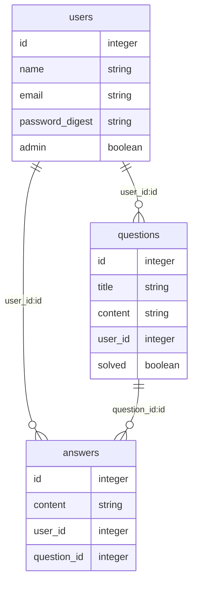

テーブル

```mermaid

erDiagram

users ||--o{ questions: "user_id:id"
users ||--o{ answers: "user_id:id"
questions ||--o{ answers: "question_id:id"

users {
  id  integer
  name  string
  email  string
  password_digest  string
  admin  boolean
}

questions {
  id  integer
  title  string
  content  string
  user_id  integer
  solved  boolean
}

answers {
  id  integer
  content  string
  user_id  integer
  question_id  integer
}
```